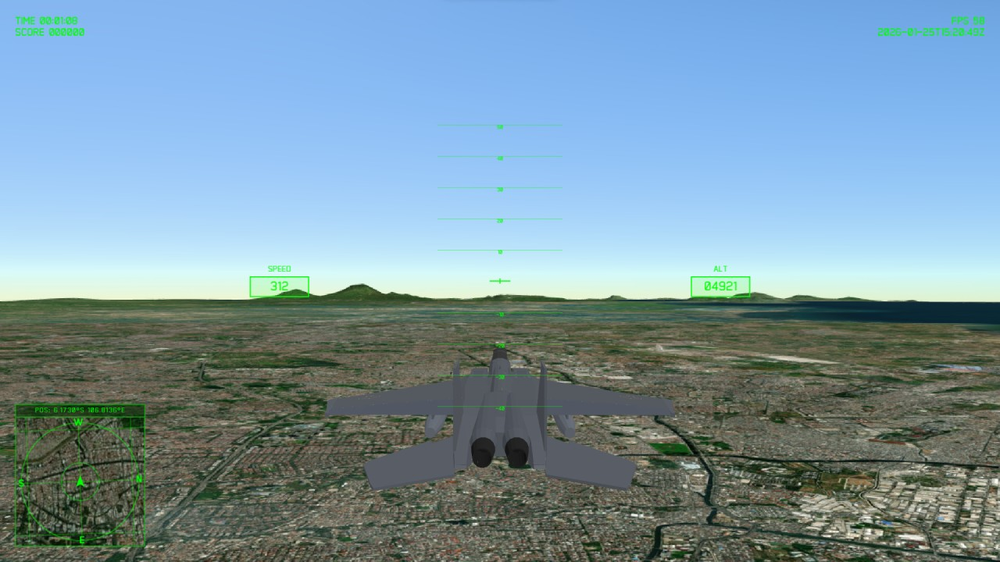

# Web Flight Simulator

A web-based flight simulator built with Three.js and CesiumJS, featuring real-world 3D terrain and interactive flight controls.



## 🚀 Features

- **Real-World Global Terrain**: Powered by CesiumJS, explore the entire world with high-resolution 3D topography.
- **Flight Controls**: Intuitive handling of pitch, roll, yaw, and speed for a smooth flying experience.
- **Dynamic HUD**: Real-time Heads-Up Display showing speed, altitude, heading, and pitch ladder.
- **Advanced Visuals**: Integrated Three.js for aircraft models and lighting effects.
- **Interactive Minimap**: GPS-style satellite minimap to track your position in real-time.
- **Multiple Game States**: Smooth transitions between main menu, spawn selection, and flight mode.

## 🛠️ Technologies Used

- **[Three.js](https://threejs.org/)**: 3D Engine for aircraft rendering and scene management.
- **[CesiumJS](https://cesium.com/platform/cesiumjs/)**: Geospatial platform for real-world 3D terrain and satellite imagery.
- **[Vite](https://vitejs.dev/)**: Next-generation frontend tooling for fast development.
- **JavaScript (ES6+)**: Core logic and simulation.

## ⌨️ Controls

| Action | Key |
| :--- | :--- |
| **Pitch Down** | `Arrow Up` |
| **Pitch Up** | `Arrow Down` |
| **Roll Left/Right** | `Arrow Left` / `Arrow Right` |
| **Yaw (Rudder)** | `A` / `D` |
| **Increase Throttle** | `W` or `Shift` |
| **Decrease Throttle** | `S` or `Ctrl` |
| **Boost** | `Space` |

## 📦 Installation & Setup

1. **Clone the repository:**
   ```bash
   git clone https://github.com/dimartarmizi/web-flight-simulator.git
   cd web-flight-simulator
   ```

2. **Install dependencies:**
   ```bash
   npm install
   ```

3. **Run development server:**
   ```bash
   npm run dev
   ```

4. **Build for production:**
   ```bash
   npm run build
   ```

## 🏷️ Credits & Attributions

- **3D Model**: ["Low poly F-15"](https://sketchfab.com/3d-models/low-poly-f-15-0c1cfa22d7094556914fcdfba75bef5d) by [SIpriv](https://sketchfab.com/sipriv), licensed under [CC BY 4.0](https://creativecommons.org/licenses/by/4.0/).
- **Engine**: [Three.js](https://threejs.org/) community and contributors.
- **Terrain & Map**: [CesiumJS](https://cesium.com/) by Cesium GS, Inc.

## 🧾 License

This project is licensed under the ISC License.
